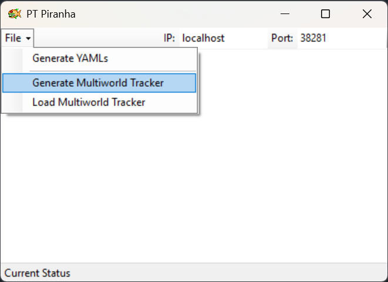
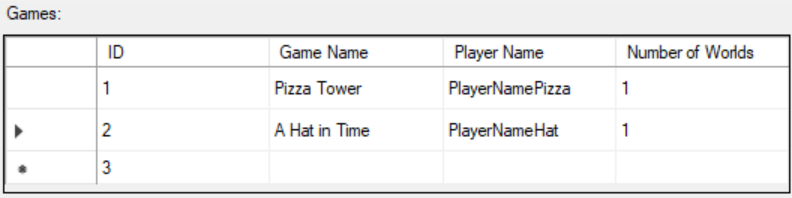
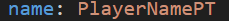
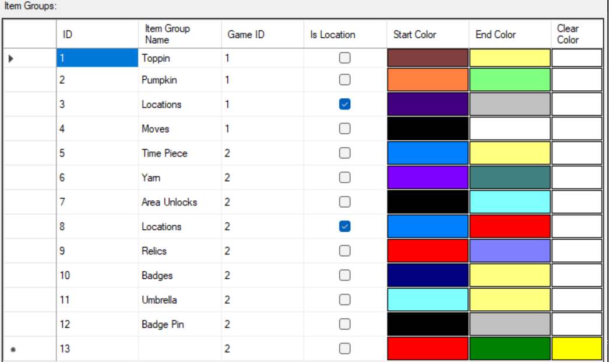
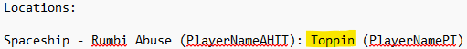
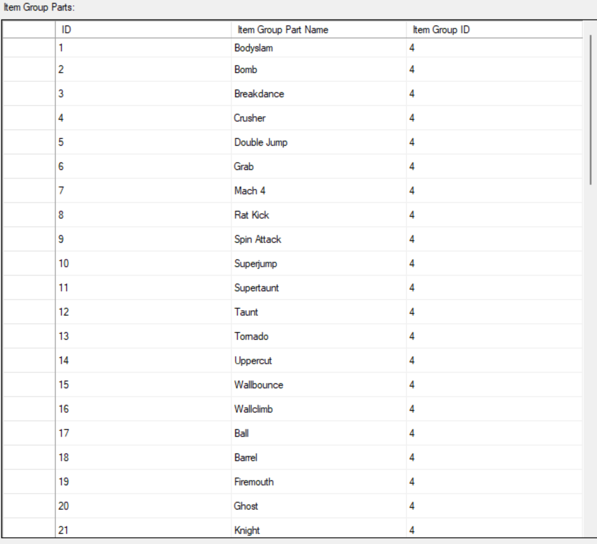
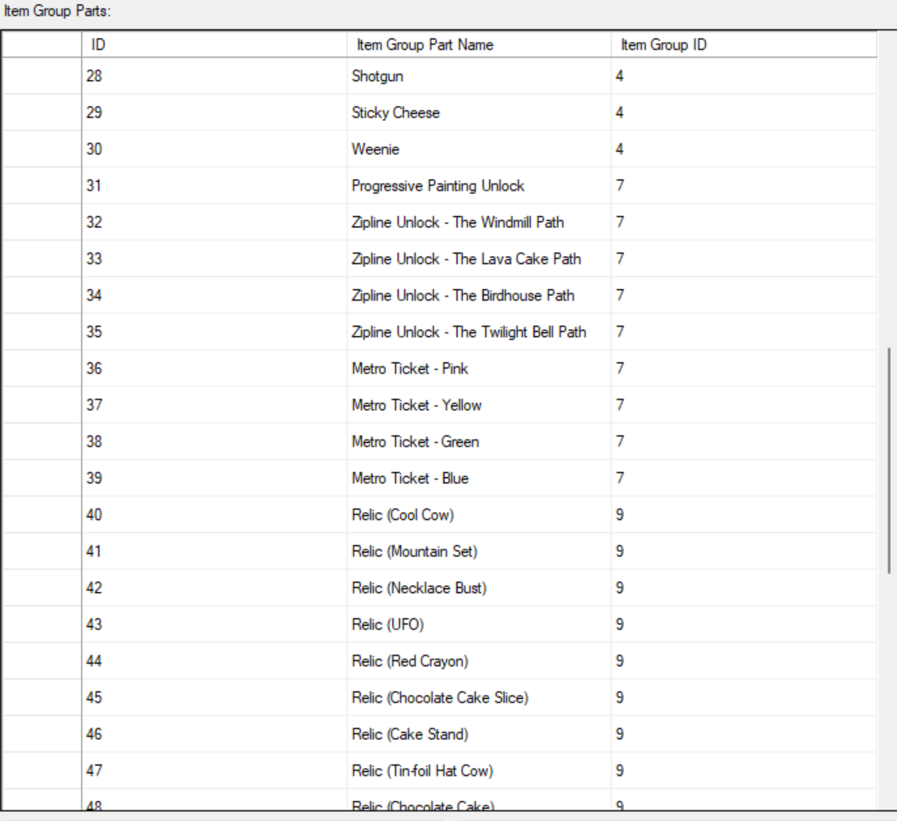

<h1>PT Piranha</h1>
PT Piranha is a Winform application that acts as a Multiworld Tracker for archipelago games. 

<h2>Archipelago</h2>
https://archipelago.gg/ is a tool for generating multiworld randomizers. 
<h2>Purpose</h2>
PT Piranha was created to assist in Centipelago challenges which require completing a multiworld consisting of 100 copies of the same world. 
The way PT Piranha assists is by allowing the user to duplicate YAMLs quickly, and by allowing them to track progress over all of their worlds at once in one big display.
<h2>How To Use</h2>
<h3>What you will need</h3>
PT Piranha https://github.com/DannySchultzDev/PT-Piranha/releases
<h4>What you need for Archipelago normally</h4>
Leagaly obtained copies of any games you are randomizing 
Archipelago mods for any games you are randomizing 
The Archipelago tool https://github.com/ArchipelagoMW/Archipelago/releases 
AP Worlds for any games you are randomizing 
<h3>I was told to provide a tracker file for my game(s). What do I do?</h3>
<h4>Open PT Piranha and select File > Generate Multiworld Tracker</h4>

This will open the Multiworld Tracker Generator which will be where you create your game's tracker. 
The Multiworld Tracker Generator consists of 3 tables: a Games table, an Item Groups table, and an Item Group Parts table, each of which will be explained in the following paragraphs.
<h4>Add all of your games to the Game's table</h4>

You will need to create a row for each unique game you are running. (If you are running multiple copies of the same world as generated by the YAML Generator you only need a single row for all copies). 
The ID column is autogenerated and is an index value for each game. This will be used by the Item Groups table to assign each item group to a game. 
The Game Name column should contain the official name of your game. This can be found in your YAML under game:

The Player Name column should contain your player name. This can be found in your YAML under name:

If you have multiple copies of the world as generated by the YAML Generator, you do not need to include the number at the end of the player name in the YAML. 
The Number of Worlds column should contain how many copies of the world you are playing. If you did not duplicate YAMLs with the YAML Generator this should be 1.
<h4>Add all of the item groups you want to track to the Item Groups table</h4>

Each row in the Item Groups table will be represented by a section of the tracker. 
Similar to the ID column in the Games table, the ID column in the Item Groups table is autogenerated, and will be used by the Item Group Parts table to assign each item group part to an item group. 
The Item Group Name column is the name of the item group. If you only have a single item type in the group, by naming the item group after the item type, you will not need to include an entry in the Item Group Parts table. 
For instance the macguffins in Pizza Tower are "Toppin"s, and as such in order to track them I added the "Toppin" Item Group. 
Alternatively there are also several moves in Pizza Tower which in Archipelago can be set to be items. Since these moves are named individualy I created the "Moves" Item Group, and listed all of Pizza Tower's moves in the Item Group Parts table. 
To find the official name for an item, look at what it is called in the spoiler log:

The Game ID column is the game the item group belongs to. For instance in the example the first 4 item groups shown belong to Pizza Tower and are labeled with 1, while the rest belong to A Hat in Time and are labeled with 2. 
The Is Location column is whether or not the item group actually represents all the locations in the game. When checked the item group will ignore whenether an item is received, and will increment whenether a location is checked. 
The Start Color column is the color that the section of the tracker will start as when you have 0% of that item group's items. 
The End Color column is the color that the section of the tracker will lerp towards as you gain that item group's items. 
The Clear Color column is the color that the section of the tracker will switch to once you have 100% of that item group's items.
<h4>Add all of the items that make up your item group parts to the Item Group Parts table</h4>

If the item group can be represented by a single item type, the item group name in the Item Groups table can be set to the item type, and this table can be bypassed. 
This table is for item groups that include multiple item types. 
The ID column is simply for indexing and is autogenerated. 
The Item Group Part Name is the name of the item type that is part of the item group. 
To find the official name for an item, look at what it is called in the spoiler log:

The Item Group ID column is the item group the item group part belongs to. For instance the first 30 item group parts are all moves in Pizza Tower. The "Moves" item group is the 4th one in the Item Groups table, so all of the Pizza Tower moves in the Item Group Parts table have an Item Group ID of 4. 
Item Group Parts represent types, which don't have to be unique items. For instance the Zipline Unlocks and Metro Tickets in A Hat in Time are unique, while Progressive Painting Unlock, is a progressive item that has multiple coppies, yet both can appear as Item Group Parts under the item group Area Unlocks.
<h4>Click Generate Multiworld Tracker to generate your tracker</h4>
Save off your Multiworld Tracker and send the file to the person who requested it. 
If you need to make an edit to your Multiworld Tracker, you can reopen the Multiworld Tracker Generator, click Add Existing Multiworld Tracker, and then select your file. 
<h2>Future Plans</h2>
Bug fixes/minor changes, lots of them. 
Current issues include: 
Joining a room causes clients to complain about a bad request. 
Add field for password. 
Add auto refresh if disconnected or at least a button to reload. 
Probably a whole bunch of stuff I haven't thought of. 
 
Adding Gradient support to Multiworld Tracker editor.(Technically extra keys can be added in the XML manually) 
Adding more display options for the Multiworld Tracker viewer (Seperated by game, jumbled, count to size correlated, voronoi). 
Image support for clear color. 
Image support for overlays. 
Additional Gradient Styles (clamp to next).
<h2>Naming</h2>
PT stands for Pizza Tower since that was the first use case. Specifically named after the Piraneapple enemy.
